Autism screening in adults
================
Luigi Ciceri

The goal of this project is to create a model which can predict Autism
Spectrum Disorder (ASD) in adults.

ASD is a medical condition associated with problems in social
relationships and repetitive behaviour patterns. The diagnosis process
is long and complicated and sometimes this condition stays unnoticed for
a very long time.

This prediction project could be useful as an indication that further
investigation with a professional might be needed.

## The data

The data was found on UCI and is provided by *Fadi Fayez Thabtah,
Manukau Institute of Technology, Auckland* and has been collected
through an app. It contains 21 features which proved to be useful in
detecting ASD. They are:

- A1 to A10 score: a score given by the [Autism Spectrum Quotient (AQ)
  test](https://docs.autismresearchcentre.com/tests/AQ10.pdf)
- Age
- Gender
- Ethnicity
- Jaundice: whether or not the participant was born with jaundice
  (yellowish or greenish pigmentation of the skin and sclera)
- Autism: whether or not the participant has a relative with autism
- Country of residence
- Used app before: whether or not the participant already used the app
- Result: sum of A1 to A10 score
- Age description
- Relation: who filled the form
- Class/ASD: whether or not the participant was classified with autism

*Class\ASD* is the feature to be predicted

## Project setup

The packages `ranger` and `xgboost` must be installed The following
packages must also be installed.

``` r
library(farff) 
library(ggplot2) 
library(naniar) 
library(UpSetR) 
library(dplyr) 
library(stringr) 
library(tidyverse) 
library(tidymodels) 
library(vip)
library(corrplot) 
library(ROSE) 
library(countrycode) 
library(rpart.plot)
library(knitr)
library(mice)
library(utils)
```

## Data preprocessing

Download the data from UCI and extract the *.arff* file

``` r
dir.create("data")
```

    ## Warning in dir.create("data"): 'data' già esistente

``` r
download.file("https://archive.ics.uci.edu/static/public/426/autism+screening+adult.zip",
              "data/ASD.zip")
unzip("data/ASD.zip",exdir="data")
file.remove(list.files(path='./data',pattern='*.zip|*.docx',full.names = T))
```

    ## [1] TRUE TRUE

### Data cleaning

Import the data into a data frame and convert to appropriate data types

``` r
set.seed(8421)
data <- readARFF("data/Autism-Adult-Data.arff")
```

    ## Parse with reader=readr : data/Autism-Adult-Data.arff

    ## header: 0.016000; preproc: 0.000000; data: 0.096000; postproc: 0.002000; total: 0.114000

``` r
data <- type.convert(data,as.is=F)
```

Plot a summary of the data

``` r
summary(data)
```

    ##     A1_Score         A2_Score         A3_Score         A4_Score     
    ##  Min.   :0.0000   Min.   :0.0000   Min.   :0.0000   Min.   :0.0000  
    ##  1st Qu.:0.0000   1st Qu.:0.0000   1st Qu.:0.0000   1st Qu.:0.0000  
    ##  Median :1.0000   Median :0.0000   Median :0.0000   Median :0.0000  
    ##  Mean   :0.7216   Mean   :0.4531   Mean   :0.4574   Mean   :0.4957  
    ##  3rd Qu.:1.0000   3rd Qu.:1.0000   3rd Qu.:1.0000   3rd Qu.:1.0000  
    ##  Max.   :1.0000   Max.   :1.0000   Max.   :1.0000   Max.   :1.0000  
    ##                                                                     
    ##     A5_Score         A6_Score         A7_Score         A8_Score     
    ##  Min.   :0.0000   Min.   :0.0000   Min.   :0.0000   Min.   :0.0000  
    ##  1st Qu.:0.0000   1st Qu.:0.0000   1st Qu.:0.0000   1st Qu.:0.0000  
    ##  Median :0.0000   Median :0.0000   Median :0.0000   Median :1.0000  
    ##  Mean   :0.4986   Mean   :0.2841   Mean   :0.4176   Mean   :0.6491  
    ##  3rd Qu.:1.0000   3rd Qu.:1.0000   3rd Qu.:1.0000   3rd Qu.:1.0000  
    ##  Max.   :1.0000   Max.   :1.0000   Max.   :1.0000   Max.   :1.0000  
    ##                                                                     
    ##     A9_Score        A10_Score           age        gender 
    ##  Min.   :0.0000   Min.   :0.0000   Min.   : 17.0   f:337  
    ##  1st Qu.:0.0000   1st Qu.:0.0000   1st Qu.: 21.0   m:367  
    ##  Median :0.0000   Median :1.0000   Median : 27.0          
    ##  Mean   :0.3239   Mean   :0.5739   Mean   : 29.7          
    ##  3rd Qu.:1.0000   3rd Qu.:1.0000   3rd Qu.: 35.0          
    ##  Max.   :1.0000   Max.   :1.0000   Max.   :383.0          
    ##                                    NA's   :2              
    ##            ethnicity   jundice   austim                 contry_of_res
    ##  White-European :233   no :635   no :613   United States       :113  
    ##  Asian          :123   yes: 69   yes: 91   United Arab Emirates: 82  
    ##  Middle Eastern : 92                       India               : 81  
    ##  Black          : 43                       New Zealand         : 81  
    ##  South Asian    : 36                       United Kingdom      : 77  
    ##  (Other)        : 82                       Jordan              : 47  
    ##  NA's           : 95                       (Other)             :223  
    ##  used_app_before     result              age_desc  
    ##  no :692         Min.   : 0.000   18 and more:704  
    ##  yes: 12         1st Qu.: 3.000                    
    ##                  Median : 4.000                    
    ##                  Mean   : 4.875                    
    ##                  3rd Qu.: 7.000                    
    ##                  Max.   :10.000                    
    ##                                                    
    ##                      relation   Class/ASD
    ##  Health care professional:  4   NO :515  
    ##  Others                  :  5   YES:189  
    ##  Parent                  : 50            
    ##  Relative                : 28            
    ##  Self                    :522            
    ##  NA's                    : 95            
    ## 

The summary reveals the following:

- The scores A1 to A10 take value 0 or 1 without missing values
- The *age* feature has *2* missing value and a maximum value of *383*
  (probable outlier)
- The *ethnicity* feature has *95* missing values
- The *age_desc* observations take only one value
- The *relation* feature has *95* missing values
- There are some misspelling errors and some feature names are poorly
  assigned

Rename the badly assigned and misspelt features

``` r
data <- rename(data, 'country_of_res' = "contry_of_res")
data <- rename(data, 'class' = "Class/ASD")
data <- rename(data, 'parent_autism' = "austim")
data <- rename(data, 'jaundice' = "jundice")
```

Remove the *age_desc* feature as it doesn’t bring any information.
*result* is also removed as it is just the sum of questions scores.

``` r
data <- subset(data, select = -c(age_desc, result))
```

All country names are correct

``` r
data %>% count(country_of_res)
```

    ##          country_of_res   n
    ## 1           Afghanistan  13
    ## 2         AmericanSamoa   2
    ## 3                Angola   1
    ## 4             Argentina   2
    ## 5               Armenia   2
    ## 6                 Aruba   1
    ## 7             Australia  27
    ## 8               Austria   4
    ## 9            Azerbaijan   1
    ## 10              Bahamas   2
    ## 11           Bangladesh   3
    ## 12              Belgium   3
    ## 13              Bolivia   1
    ## 14               Brazil   9
    ## 15              Burundi   1
    ## 16               Canada  15
    ## 17                Chile   1
    ## 18                China   1
    ## 19           Costa Rica   1
    ## 20               Cyprus   1
    ## 21       Czech Republic   1
    ## 22              Ecuador   1
    ## 23                Egypt   3
    ## 24             Ethiopia   2
    ## 25              Finland   1
    ## 26               France  11
    ## 27              Germany   4
    ## 28            Hong Kong   1
    ## 29              Iceland   2
    ## 30                India  81
    ## 31            Indonesia   1
    ## 32                 Iran   7
    ## 33                 Iraq   1
    ## 34              Ireland   5
    ## 35                Italy   5
    ## 36                Japan   1
    ## 37               Jordan  47
    ## 38           Kazakhstan   3
    ## 39              Lebanon   1
    ## 40             Malaysia   5
    ## 41               Mexico   8
    ## 42                Nepal   1
    ## 43          Netherlands  10
    ## 44          New Zealand  81
    ## 45            Nicaragua   1
    ## 46                Niger   1
    ## 47                 Oman   1
    ## 48             Pakistan   3
    ## 49          Philippines   4
    ## 50             Portugal   1
    ## 51              Romania   3
    ## 52               Russia   7
    ## 53         Saudi Arabia   4
    ## 54               Serbia   1
    ## 55         Sierra Leone   1
    ## 56         South Africa   2
    ## 57                Spain   3
    ## 58            Sri Lanka  14
    ## 59               Sweden   2
    ## 60                Tonga   1
    ## 61               Turkey   1
    ## 62              Ukraine   2
    ## 63 United Arab Emirates  82
    ## 64       United Kingdom  77
    ## 65        United States 113
    ## 66              Uruguay   1
    ## 67             Viet Nam   5

All ethnicities are correct but there is a misspelling

``` r
data %>% count(ethnicity)
```

    ##          ethnicity   n
    ## 1            Asian 123
    ## 2            Black  43
    ## 3         Hispanic  13
    ## 4           Latino  20
    ## 5  Middle Eastern   92
    ## 6           others   1
    ## 7           Others  30
    ## 8         Pasifika  12
    ## 9      South Asian  36
    ## 10         Turkish   6
    ## 11  White-European 233
    ## 12            <NA>  95

Change *others* to *Others*

``` r
data <- data %>% mutate(across("ethnicity", \(x) str_replace(x, "others", "Others")))
```

All relation string are correct but *Health care professional* is too
long

``` r
data %>% count(relation)
```

    ##                   relation   n
    ## 1 Health care professional   4
    ## 2                   Others   5
    ## 3                   Parent  50
    ## 4                 Relative  28
    ## 5                     Self 522
    ## 6                     <NA>  95

Rename it

``` r
data <- data %>%  mutate(across("relation", \(x) str_replace(x, "Health care professional", "Professional")))
```

### Outliers analysis

Only numerical predictors are considered in this analysis.

As noted before a sample is way outside the range with a value of *383*
.

This might be an input error during the form filling procedure so it is
replaced with *38* which makes more sense.

``` r
data <- data %>% mutate(age=ifelse(age==383,38,age))
```

``` r
data %>% 
  ggplot(aes(y = age)) + 
  geom_boxplot(width = 0.05, fill = "salmon") + 
  xlim(-0.1, 0.1) + 
  theme_minimal() + 
  theme(axis.ticks.x = element_blank(), axis.text.x = element_blank())
```

    ## Warning: Removed 2 rows containing non-finite outside the scale range
    ## (`stat_boxplot()`).

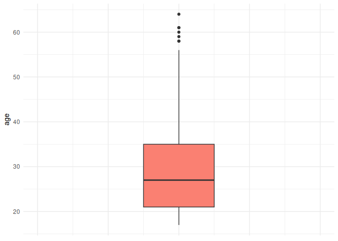<!-- -->

The median is around *37* with some values above the upper IQR limit
which however are within age limits.

``` r
data %>% 
  ggplot(aes(x = age)) + geom_histogram(fill = "thistle", color = "black") +
  theme_minimal()
```

    ## `stat_bin()` using `bins = 30`. Pick better value with `binwidth`.

    ## Warning: Removed 2 rows containing non-finite outside the scale range
    ## (`stat_bin()`).

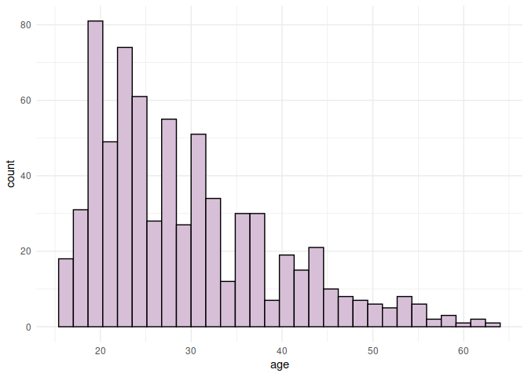<!-- -->

The distribution of age is shifted to the right, however applying a log
transformation to move it towards a normal distribution did not make any
difference on the final result.

### Missing values analysis

Since the *A1* to *A10* features are difficult to analyze and don’t
contain any missing value, only the non question data is considered.

``` r
gg_miss_var(data)
```

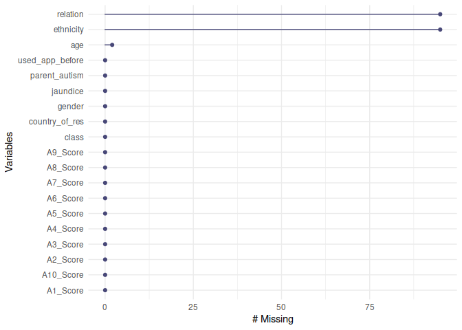<!-- -->

``` r
no_q_data <- data[, 11:19]
```

To understand the nature of the missing data look at the relationship
between missing values across features

``` r
gg_miss_upset(no_q_data, nsets = n_var_miss(no_q_data))
```

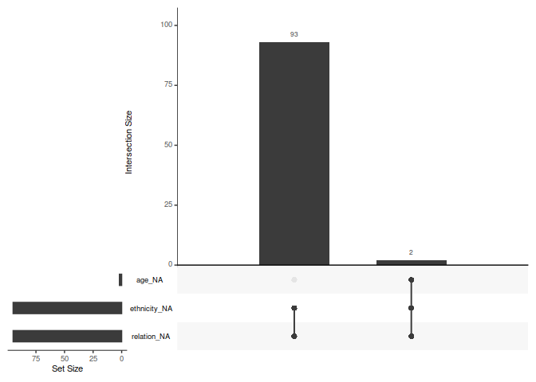<!-- -->

In all samples where there is at least a missing value, both *ethnicity*
and *relation* are missing. In *2* cases *age* is also missing.

Look at the samples to see if there is a relationship between features
and missing data

``` r
relation_na <- no_q_data[is.na(no_q_data$ethnicity), ]
relation_na
```

    ##     age gender ethnicity jaundice parent_autism       country_of_res
    ## 5    40      f      <NA>       no            no                Egypt
    ## 13   17      f      <NA>       no            no              Bahamas
    ## 14   17      m      <NA>       no            no              Austria
    ## 15   17      f      <NA>       no            no            Argentina
    ## 20   34      m      <NA>      yes            no United Arab Emirates
    ## 21   38      m      <NA>       no            no United Arab Emirates
    ## 25   43      m      <NA>       no            no              Lebanon
    ## 26   24      f      <NA>      yes            no          Afghanistan
    ## 63   NA      m      <NA>       no            no         Saudi Arabia
    ## 80   45      f      <NA>      yes            no               Jordan
    ## 81   32      m      <NA>      yes           yes          Afghanistan
    ## 82   30      m      <NA>       no            no               Jordan
    ## 92   NA      f      <NA>       no            no               Jordan
    ## 217  37      f      <NA>      yes            no United Arab Emirates
    ## 222  27      f      <NA>       no            no          Afghanistan
    ## 239  21      m      <NA>       no            no               Russia
    ## 258  25      m      <NA>       no            no          New Zealand
    ## 271  22      f      <NA>       no           yes               Russia
    ## 277  30      m      <NA>       no            no               Jordan
    ## 278  32      f      <NA>       no           yes               Jordan
    ## 286  32      f      <NA>       no            no            Hong Kong
    ## 307  28      f      <NA>       no            no         Saudi Arabia
    ## 316  20      m      <NA>       no            no United Arab Emirates
    ## 325  37      f      <NA>       no            no United Arab Emirates
    ## 338  20      m      <NA>       no            no               Jordan
    ## 339  22      f      <NA>       no            no               Jordan
    ## 340  21      f      <NA>       no            no               Jordan
    ## 341  21      f      <NA>       no            no               Jordan
    ## 342  19      m      <NA>       no            no               Jordan
    ## 343  21      f      <NA>       no            no               Jordan
    ## 344  21      m      <NA>       no            no               Jordan
    ## 345  23      f      <NA>       no            no               Jordan
    ## 346  21      m      <NA>       no            no               Jordan
    ## 347  21      m      <NA>       no            no               Jordan
    ## 348  23      m      <NA>       no            no               Jordan
    ## 349  20      f      <NA>       no            no               Jordan
    ## 350  21      f      <NA>       no            no               Jordan
    ## 351  20      m      <NA>       no            no            Argentina
    ## 352  19      m      <NA>       no            no               Jordan
    ## 353  21      m      <NA>       no            no               Jordan
    ## 354  26      m      <NA>       no           yes               Jordan
    ## 355  21      m      <NA>       no            no               Jordan
    ## 356  19      m      <NA>       no            no                Japan
    ## 362  19      f      <NA>       no            no              Ukraine
    ## 366  20      m      <NA>       no            no United Arab Emirates
    ## 370  20      m      <NA>      yes            no United Arab Emirates
    ## 371  20      f      <NA>       no            no United Arab Emirates
    ## 373  19      m      <NA>       no            no           Kazakhstan
    ## 379  20      f      <NA>       no            no United Arab Emirates
    ## 380  20      m      <NA>       no            no United Arab Emirates
    ## 381  20      f      <NA>       no            no               Jordan
    ## 382  23      f      <NA>       no            no               Jordan
    ## 383  21      f      <NA>       no            no               Jordan
    ## 384  22      m      <NA>       no            no               Jordan
    ## 385  21      f      <NA>       no            no               Jordan
    ## 386  20      f      <NA>       no            no               Jordan
    ## 387  22      f      <NA>       no            no               Jordan
    ## 388  21      f      <NA>      yes            no               Jordan
    ## 389  20      f      <NA>       no            no               Jordan
    ## 391  21      m      <NA>       no            no               Jordan
    ## 396  19      f      <NA>       no            no United Arab Emirates
    ## 400  19      f      <NA>       no            no           Kazakhstan
    ## 401  20      f      <NA>       no            no United Arab Emirates
    ## 402  26      f      <NA>       no            no United Arab Emirates
    ## 404  28      f      <NA>       no            no United Arab Emirates
    ## 424  29      f      <NA>       no            no United Arab Emirates
    ## 428  21      m      <NA>       no            no               Jordan
    ## 429  20      f      <NA>       no            no               Brazil
    ## 430  20      m      <NA>       no            no               Jordan
    ## 433  19      m      <NA>       no            no               Jordan
    ## 439  21      f      <NA>       no            no               Jordan
    ## 454  19      f      <NA>      yes            no               Jordan
    ## 486  21      m      <NA>       no            no               Jordan
    ## 506  41      m      <NA>      yes           yes       United Kingdom
    ## 519  50      f      <NA>       no            no          New Zealand
    ## 528  26      f      <NA>       no            no                 Iran
    ## 535  19      f      <NA>       no            no                 Iran
    ## 536  24      m      <NA>       no            no                 Iran
    ## 537  52      f      <NA>       no            no                 Iran
    ## 538  52      m      <NA>       no            no                 Iran
    ## 557  32      m      <NA>       no            no               Jordan
    ## 565  19      m      <NA>       no            no           Kazakhstan
    ## 572  47      m      <NA>       no            no               Jordan
    ## 573  47      m      <NA>       no            no               Jordan
    ## 589  31      f      <NA>       no            no          New Zealand
    ## 594  23      m      <NA>       no            no               Russia
    ## 637  27      f      <NA>       no            no               Russia
    ## 643  31      f      <NA>       no            no          New Zealand
    ## 646  17      m      <NA>       no           yes          New Zealand
    ## 652  30      m      <NA>      yes            no               Jordan
    ## 653  33      f      <NA>       no            no        United States
    ## 659  43      m      <NA>       no            no           Azerbaijan
    ## 660  44      m      <NA>       no            no             Pakistan
    ## 667  56      m      <NA>       no            no                 Iraq
    ## 702  24      f      <NA>       no            no               Russia
    ##     used_app_before relation class
    ## 5                no     <NA>    NO
    ## 13               no     <NA>    NO
    ## 14               no     <NA>    NO
    ## 15               no     <NA>    NO
    ## 20               no     <NA>    NO
    ## 21               no     <NA>    NO
    ## 25               no     <NA>    NO
    ## 26               no     <NA>    NO
    ## 63               no     <NA>    NO
    ## 80               no     <NA>    NO
    ## 81               no     <NA>    NO
    ## 82               no     <NA>    NO
    ## 92               no     <NA>    NO
    ## 217              no     <NA>    NO
    ## 222              no     <NA>    NO
    ## 239              no     <NA>    NO
    ## 258              no     <NA>    NO
    ## 271              no     <NA>   YES
    ## 277              no     <NA>    NO
    ## 278              no     <NA>    NO
    ## 286              no     <NA>    NO
    ## 307              no     <NA>   YES
    ## 316              no     <NA>    NO
    ## 325              no     <NA>    NO
    ## 338              no     <NA>    NO
    ## 339              no     <NA>    NO
    ## 340              no     <NA>    NO
    ## 341              no     <NA>    NO
    ## 342              no     <NA>    NO
    ## 343              no     <NA>    NO
    ## 344              no     <NA>    NO
    ## 345              no     <NA>    NO
    ## 346              no     <NA>    NO
    ## 347              no     <NA>    NO
    ## 348              no     <NA>    NO
    ## 349              no     <NA>   YES
    ## 350              no     <NA>    NO
    ## 351              no     <NA>   YES
    ## 352              no     <NA>    NO
    ## 353              no     <NA>    NO
    ## 354              no     <NA>    NO
    ## 355              no     <NA>    NO
    ## 356              no     <NA>    NO
    ## 362              no     <NA>    NO
    ## 366              no     <NA>    NO
    ## 370              no     <NA>    NO
    ## 371              no     <NA>    NO
    ## 373              no     <NA>    NO
    ## 379              no     <NA>    NO
    ## 380              no     <NA>    NO
    ## 381              no     <NA>    NO
    ## 382              no     <NA>    NO
    ## 383              no     <NA>   YES
    ## 384              no     <NA>    NO
    ## 385              no     <NA>    NO
    ## 386              no     <NA>    NO
    ## 387              no     <NA>    NO
    ## 388              no     <NA>    NO
    ## 389              no     <NA>    NO
    ## 391              no     <NA>    NO
    ## 396              no     <NA>    NO
    ## 400              no     <NA>    NO
    ## 401              no     <NA>    NO
    ## 402              no     <NA>    NO
    ## 404              no     <NA>    NO
    ## 424              no     <NA>    NO
    ## 428              no     <NA>    NO
    ## 429             yes     <NA>    NO
    ## 430              no     <NA>    NO
    ## 433              no     <NA>    NO
    ## 439              no     <NA>    NO
    ## 454              no     <NA>    NO
    ## 486              no     <NA>    NO
    ## 506              no     <NA>    NO
    ## 519              no     <NA>    NO
    ## 528              no     <NA>    NO
    ## 535              no     <NA>    NO
    ## 536              no     <NA>    NO
    ## 537              no     <NA>    NO
    ## 538              no     <NA>    NO
    ## 557              no     <NA>    NO
    ## 565             yes     <NA>    NO
    ## 572              no     <NA>    NO
    ## 573              no     <NA>    NO
    ## 589              no     <NA>   YES
    ## 594              no     <NA>    NO
    ## 637              no     <NA>    NO
    ## 643              no     <NA>    NO
    ## 646              no     <NA>   YES
    ## 652              no     <NA>    NO
    ## 653              no     <NA>    NO
    ## 659              no     <NA>    NO
    ## 660              no     <NA>   YES
    ## 667              no     <NA>    NO
    ## 702              no     <NA>   YES

``` r
relation_na %>% 
  count(country_of_res) %>%
  ggplot( aes(x = n, y = country_of_res)) +
  geom_col(aes(fill = country_of_res)) +
  theme(legend.position = "none")
```

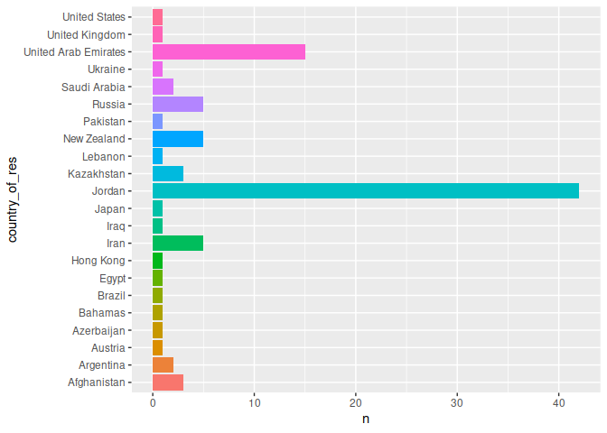<!-- -->

Most of the missing data comes from middle eastern countries. This
suggests some cultural reasons to hide some information, most likely due
to how autism is [perceived in those
regions](https://www.arabnews.com/node/1476196/middle-east).

This might be a missing at random case where the missing values depend
on the observed country of residence.

Look at the missing data distribution with respect to countries.

``` r
gg_miss_fct(x = no_q_data, fct = country_of_res)
```

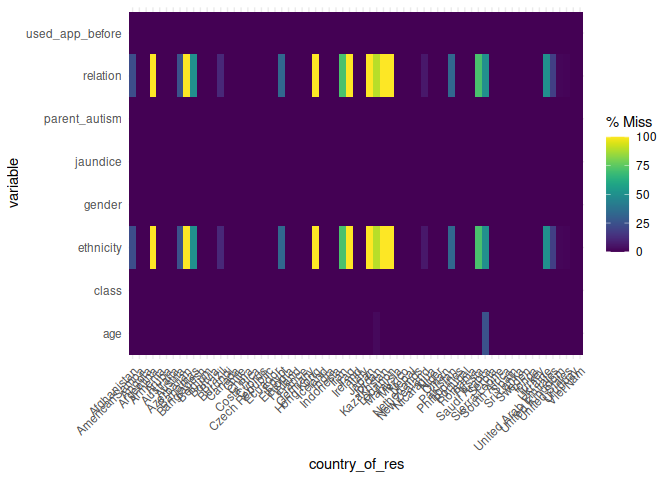<!-- -->

Some countries’ data would be lost if samples containing missing values
were deleted.

Due to the fact that this is a probable MAR case, imputation is applied
with *Multiple Imputation by Chained Equations (MICE)* to try to recover
the *ethnicity*, *age* and *relation* missing values.

``` r
imputation <- mice(type.convert(data, as.is =F ), method = 'cart')
```

    ## 
    ##  iter imp variable
    ##   1   1  age  ethnicity  relation
    ##   1   2  age  ethnicity  relation
    ##   1   3  age  ethnicity  relation
    ##   1   4  age  ethnicity  relation
    ##   1   5  age  ethnicity  relation
    ##   2   1  age  ethnicity  relation
    ##   2   2  age  ethnicity  relation
    ##   2   3  age  ethnicity  relation
    ##   2   4  age  ethnicity  relation
    ##   2   5  age  ethnicity  relation
    ##   3   1  age  ethnicity  relation
    ##   3   2  age  ethnicity  relation
    ##   3   3  age  ethnicity  relation
    ##   3   4  age  ethnicity  relation
    ##   3   5  age  ethnicity  relation
    ##   4   1  age  ethnicity  relation
    ##   4   2  age  ethnicity  relation
    ##   4   3  age  ethnicity  relation
    ##   4   4  age  ethnicity  relation
    ##   4   5  age  ethnicity  relation
    ##   5   1  age  ethnicity  relation
    ##   5   2  age  ethnicity  relation
    ##   5   3  age  ethnicity  relation
    ##   5   4  age  ethnicity  relation
    ##   5   5  age  ethnicity  relation

    ## Warning: Number of logged events: 50

``` r
stripplot(imputation, age)
```

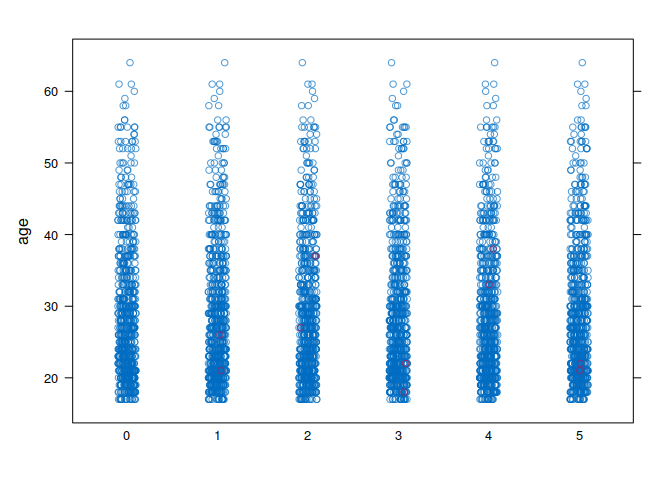<!-- -->

``` r
stripplot(imputation, ethnicity)
```

<!-- -->

``` r
stripplot(imputation, relation)
```

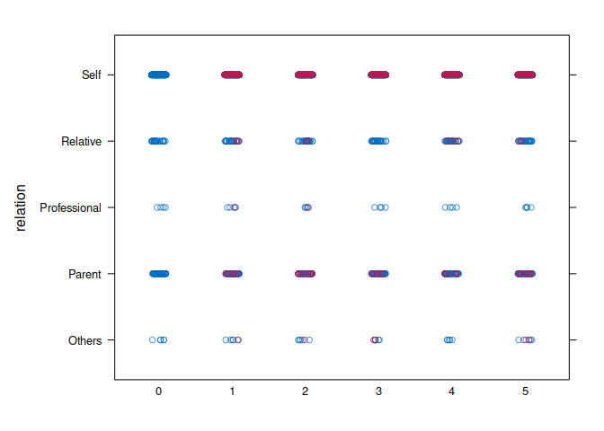<!-- -->

``` r
data <- complete(imputation)
 #data <- data %>% drop_na()
```

The imputed values seems to make sense as age is below *100* and
ethnicities are the one expected in middle eastern countries. Also given
the age of participants the majority of imputation for *relation* is
*self*.

### Data balance analysis

Look at the *class* feature balance

``` r
data %>%
  ggplot(aes(x = class)) + geom_bar(fill = "tan2", color = "black") + 
  theme_minimal()
```

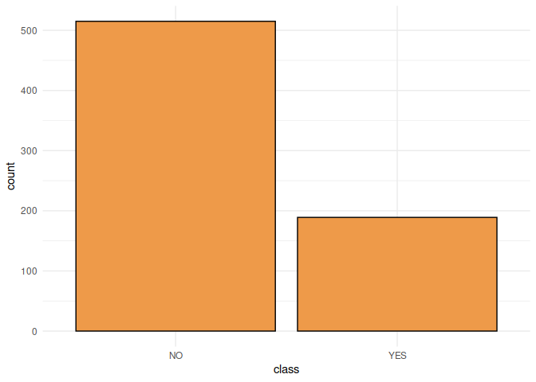<!-- -->

The labels are unbalanced with the *YES* ones being roughly half of the
*NO* ones. Later on a balancing procedure will be carried out to see if
better results can be achieved.

### Data preprocessing

As the ASD might depend on environmental factors, instead of keeping the
countries names, a more coarse representation of the geographic area of
residence is used by replacing the name of the country with its region
as defined by the *World Bank Development Indicators*. This also allows
to reduce the number of predictors when one-hot-encoding.

Since all models are tree based, normalization is not carried out.

``` r
country_to_region <- function(country) {
    return(countrycode(country, origin = "country.name", destination = "region"))
}

data <- recipe(class ~ ., data) %>%
    step_mutate_at(country_of_res, fn = country_to_region) %>%
    step_string2factor(country_of_res) %>%
    step_dummy(all_nominal_predictors()) %>%
    prep() %>%
    bake(new_data = NULL)
```

## Models training

The random forest and gradient boosting ensemble models were used for
this classification task.

The random forest was trained using the *ranger* package while the
gradient boosting with the *xgboost* package.

Both models were trained with a k-fold cross validation procedure by
creating *10* splits with stratified sampling.

The hyperparameter search was carried out with a random grid search to
improve the performance. During this process the best model was selected
according to the *f1 score* metric defined as:

$$
f1 = \frac{precision*recall}{pecision+recall}
$$

As this is a medical diagnosis task a balance between accuracy and
recall is needed. In fact false positive would be undesirable while a
false negative would discourage further medical investigation. A balance
of the two seems the best approach.

Define functions to perform the grid search which return the set of best
parameters.

``` r
random_forest_grid_search <- function(data) {
    data_folds <- vfold_cv(data)
    spec <- rand_forest(trees = tune(),
                        mtry = tune(),
                        min_n = tune(),
                        mode = "classification") %>% 
      set_engine("ranger", importance = "impurity")
    recipe <- recipe(class ~ ., data)
    wf <- workflow() %>%
        add_model(spec) %>%
        add_recipe(recipe)
    tune <- wf %>% 
      tune_grid(data_folds,
                grid = grid_random(trees(range = c(100, 500)),
                                   mtry(range = c(5, 15)),
                                   min_n(range = c(6, 8))),
                metrics = metric_set(f_meas))
    print(autoplot(tune, metric = "f_meas"))
    print(tune %>% collect_metrics())
    best <- tune %>% 
      select_best(metric = "f_meas")
    return(finalize_model(spec, best))
}
```

``` r
extreme_gradient_grid_search <- function(data) {
    data_folds <- vfold_cv(data)
    spec <- boost_tree(trees = tune(),
                       mtry = tune(),
                       min_n = tune(),
                       tree_depth = tune(),
                       learn_rate = tune(),
                       mode = "classification") %>%
        set_engine("xgboost") %>%
        set_mode("classification")
    recipe <- recipe(class ~ ., data)
    wf <- workflow() %>%
        add_model(spec) %>%
        add_recipe(recipe)
    tune <- wf %>%
        tune_grid(data_folds,
                  grid = grid_random(trees(range = c(10, 50))
                                     , mtry(range = c(5, 15)),
                                     min_n(range = c(6, 8)),
                                     tree_depth(range = c(4, 12)),
                                     learn_rate(), size = 50),
                  metrics = metric_set(f_meas))
    print(autoplot(tune, metric = "f_meas"))
    print(tune %>% collect_metrics())
    best <- tune %>%
        select_best(metric = "f_meas")
    return(finalize_model(spec, best))
}
```

Define functions to train the best model obtained from the grid search

``` r
train_extreme_gradient <- function(data) {
    best <- extreme_gradient_grid_search(data)
    args <- best$args
    spec <- boost_tree(trees = args$trees[[2]],
                       mtry = args$mtry[[2]],
                       min_n = args$min_n[[2]],
                       tree_depth = args$tree_depth[[2]],
                       learn_rate = args$learn_rate[[2]]) %>%
        set_engine("xgboost") %>%
        set_mode("classification")
    recipe <- recipe(class ~ ., data)
    wf <- workflow() %>%
        add_model(spec) %>%
        add_recipe(recipe)
    return(fit(wf, data))
}
```

``` r
train_random_forest <- function(data) {
    best <- random_forest_grid_search(data)
    recipe <- recipe(class ~ ., data)
    args <- best$args
    spec <- rand_forest(trees = args$trees[[2]],
                        mtry = args$mtry[[2]],
                        min_n = args$min_n[[2]],
                        mode = "classification") %>%
        set_engine("ranger", importance = "impurity")
    wf <- workflow() %>%
        add_model(spec) %>%
        add_recipe(recipe)
    return(fit(wf, data))
}
```

### Imbalanced data

Train the random forest

``` r
set.seed(8421)
forest <- train_random_forest(data)
```

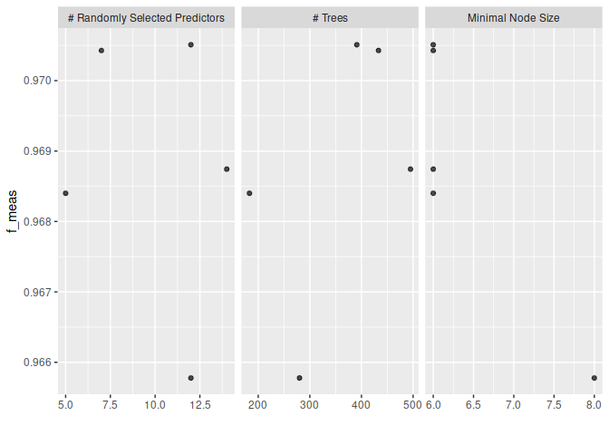<!-- -->

    ## # A tibble: 5 × 9
    ##    mtry trees min_n .metric .estimator  mean     n std_err .config             
    ##   <int> <int> <int> <chr>   <chr>      <dbl> <int>   <dbl> <chr>               
    ## 1    12   280     8 f_meas  binary     0.966    10 0.00442 Preprocessor1_Model1
    ## 2    12   391     6 f_meas  binary     0.971    10 0.00361 Preprocessor1_Model2
    ## 3     5   183     6 f_meas  binary     0.968    10 0.00447 Preprocessor1_Model3
    ## 4    14   495     6 f_meas  binary     0.969    10 0.00453 Preprocessor1_Model4
    ## 5     7   433     6 f_meas  binary     0.970    10 0.00435 Preprocessor1_Model5

``` r
forest
```

    ## ══ Workflow [trained] ══════════════════════════════════════════════════════════
    ## Preprocessor: Recipe
    ## Model: rand_forest()
    ## 
    ## ── Preprocessor ────────────────────────────────────────────────────────────────
    ## 0 Recipe Steps
    ## 
    ## ── Model ───────────────────────────────────────────────────────────────────────
    ## Ranger result
    ## 
    ## Call:
    ##  ranger::ranger(x = maybe_data_frame(x), y = y, mtry = min_cols(~args$mtry[[2]],      x), num.trees = ~args$trees[[2]], min.node.size = min_rows(~args$min_n[[2]],      x), importance = ~"impurity", num.threads = 1, verbose = FALSE,      seed = sample.int(10^5, 1), probability = TRUE) 
    ## 
    ## Type:                             Probability estimation 
    ## Number of trees:                  391 
    ## Sample size:                      704 
    ## Number of independent variables:  34 
    ## Mtry:                             12 
    ## Target node size:                 6 
    ## Variable importance mode:         impurity 
    ## Splitrule:                        gini 
    ## OOB prediction error (Brier s.):  0.04124834

The best model has an f1 score of *0.97* on the cross validation splits.
When trained on all data the Out Of Bag error is *0.041*.

``` r
plot(forest %>% extract_fit_parsnip() %>% vip())
```

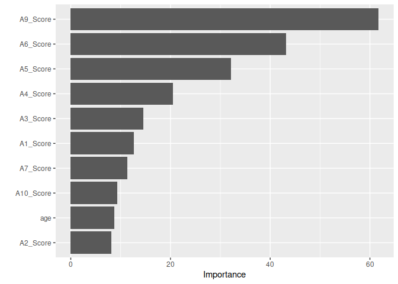<!-- -->

From the variable importance plot of the 10 most influential predictors,
the answer to question *9* seems the most influential followed by
question *6* and *5*. Of the non question feature, the most influential
is the *age*.

Train the gradient boosting

``` r
set.seed(8421)
gb <- train_extreme_gradient(data)
```

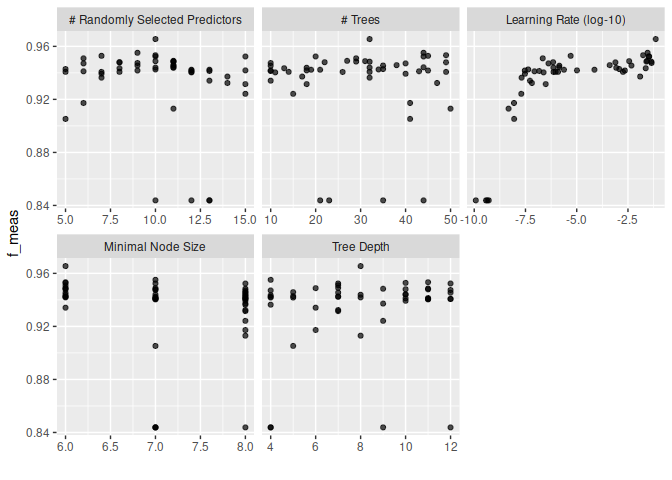<!-- -->

    ## # A tibble: 50 × 11
    ##     mtry trees min_n tree_depth    learn_rate .metric .estimator  mean     n
    ##    <int> <int> <int>      <int>         <dbl> <chr>   <chr>      <dbl> <int>
    ##  1     5    41     7          5 0.00000000885 f_meas  binary     0.905    10
    ##  2     5    14     7         11 0.000000925   f_meas  binary     0.941    10
    ##  3     5    35     8          5 0.00119       f_meas  binary     0.943    10
    ##  4     6    29     6          7 0.000000221   f_meas  binary     0.951    10
    ##  5     6    43     7         10 0.0000000869  f_meas  binary     0.941    10
    ##  6     6    40     8          4 0.000000421   f_meas  binary     0.947    10
    ##  7     6    41     8          6 0.00000000872 f_meas  binary     0.917    10
    ##  8     7    45     6         10 0.00000506    f_meas  binary     0.953    10
    ##  9     7    32     8          4 0.0000000205  f_meas  binary     0.936    10
    ## 10     7    40     8         10 0.0000000299  f_meas  binary     0.939    10
    ## # ℹ 40 more rows
    ## # ℹ 2 more variables: std_err <dbl>, .config <chr>

The best model has an f1 score of *0.965* on the cross validation
splits. This is slightly lower than the random forest model.

### Balanced data

To see if the performance can be improved further the data was balanced
by oversampling

``` r
data <- ovun.sample(class ~ ., data = data, method = "both", seed = 8421)
data <- data$data
data %>% ggplot(aes(x = class)) + geom_bar(fill = "orange")
```

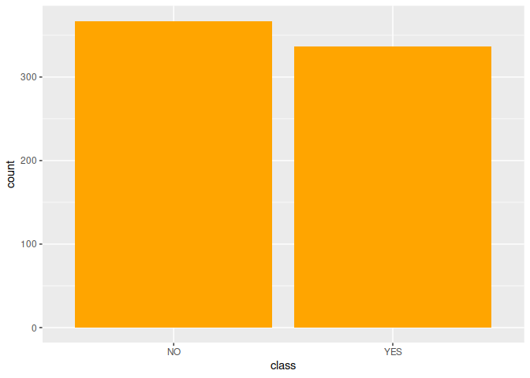<!-- -->

The data is now balanced with respect to the labels.

Train the random forest

``` r
set.seed(8421)
forest <- train_random_forest(data)
```

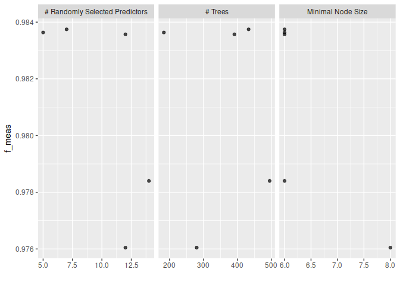<!-- -->

    ## # A tibble: 5 × 9
    ##    mtry trees min_n .metric .estimator  mean     n std_err .config             
    ##   <int> <int> <int> <chr>   <chr>      <dbl> <int>   <dbl> <chr>               
    ## 1    12   280     8 f_meas  binary     0.976    10 0.00721 Preprocessor1_Model1
    ## 2    12   391     6 f_meas  binary     0.984    10 0.00499 Preprocessor1_Model2
    ## 3     5   183     6 f_meas  binary     0.984    10 0.00442 Preprocessor1_Model3
    ## 4    14   495     6 f_meas  binary     0.978    10 0.00565 Preprocessor1_Model4
    ## 5     7   433     6 f_meas  binary     0.984    10 0.00524 Preprocessor1_Model5

``` r
forest
```

    ## ══ Workflow [trained] ══════════════════════════════════════════════════════════
    ## Preprocessor: Recipe
    ## Model: rand_forest()
    ## 
    ## ── Preprocessor ────────────────────────────────────────────────────────────────
    ## 0 Recipe Steps
    ## 
    ## ── Model ───────────────────────────────────────────────────────────────────────
    ## Ranger result
    ## 
    ## Call:
    ##  ranger::ranger(x = maybe_data_frame(x), y = y, mtry = min_cols(~args$mtry[[2]],      x), num.trees = ~args$trees[[2]], min.node.size = min_rows(~args$min_n[[2]],      x), importance = ~"impurity", num.threads = 1, verbose = FALSE,      seed = sample.int(10^5, 1), probability = TRUE) 
    ## 
    ## Type:                             Probability estimation 
    ## Number of trees:                  433 
    ## Sample size:                      704 
    ## Number of independent variables:  34 
    ## Mtry:                             7 
    ## Target node size:                 6 
    ## Variable importance mode:         impurity 
    ## Splitrule:                        gini 
    ## OOB prediction error (Brier s.):  0.02118083


Balancing the data slightly improves the performance bringing the f1
score on the cross validation splits to *0.983* while also reducing the
Out Of Bag error to *0.021*.

``` r
plot(forest %>% extract_fit_parsnip() %>% vip())
```

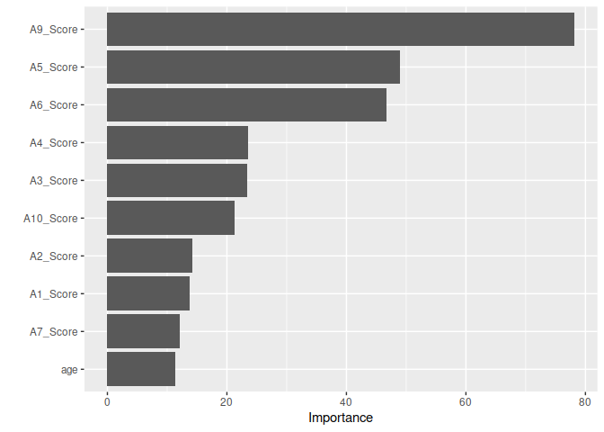<!-- -->

The variable importance is similar same as the imbalanced case.

Train the gradient boosting

``` r
set.seed(8421)
gb <- train_extreme_gradient(data)
```

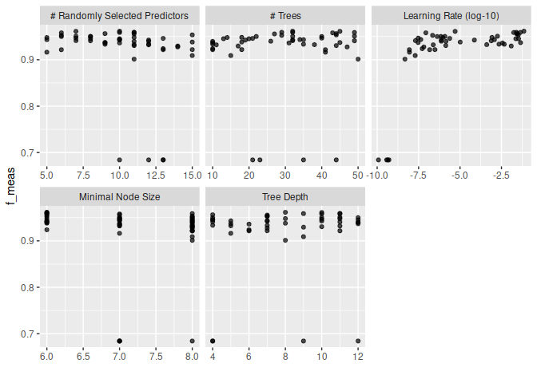<!-- -->

    ## # A tibble: 50 × 11
    ##     mtry trees min_n tree_depth    learn_rate .metric .estimator  mean     n
    ##    <int> <int> <int>      <int>         <dbl> <chr>   <chr>      <dbl> <int>
    ##  1     5    41     7          5 0.00000000885 f_meas  binary     0.916    10
    ##  2     5    14     7         11 0.000000925   f_meas  binary     0.948    10
    ##  3     5    35     8          5 0.00119       f_meas  binary     0.943    10
    ##  4     6    29     6          7 0.000000221   f_meas  binary     0.953    10
    ##  5     6    43     7         10 0.0000000869  f_meas  binary     0.958    10
    ##  6     6    40     8          4 0.000000421   f_meas  binary     0.950    10
    ##  7     6    41     8          6 0.00000000872 f_meas  binary     0.922    10
    ##  8     7    45     6         10 0.00000506    f_meas  binary     0.961    10
    ##  9     7    32     8          4 0.0000000205  f_meas  binary     0.941    10
    ## 10     7    40     8         10 0.0000000299  f_meas  binary     0.946    10
    ## # ℹ 40 more rows
    ## # ℹ 2 more variables: std_err <dbl>, .config <chr>

Also in this case th performance is almost the same as the imbalanced
case with an f1 score of *0.961*.

### Interpretation

Before the conclusion it might be helpful to train a simple tree on the
data to have an idea of how the model interprets the data. This is just
for summarization purposes as training a single tree which is highly
influenced by the dataset split is not a good practice.

Create a train and evaluation split on the balanced data

``` r
data_split <- initial_split(data, prop = 0.8, strata = "class")
train_data <- training(data_split)
test_data <- testing(data_split)
```

Define function to train and evaluate the tree

``` r
train_tree <- function(data) {
    spec <- decision_tree(mode = "classification", tree_depth = 5, min_n = 10)
    recipe <- recipe(class ~ ., data)
    wf <- workflow() %>%
        add_model(spec) %>%
        add_recipe(recipe)
    return(fit(wf, data))
}

evaluate_model <- function(model, eval_data) {
    eval_pred <- model %>%
        predict(eval_data, type = "class") %>%
        bind_cols(eval_data)
    print(eval_pred %>% metrics(truth = class, estimate = .pred_class))
    print(eval_pred %>%  f_meas(truth = class, estimate = .pred_class))
    print(autoplot(eval_pred %>% conf_mat(truth = class, .pred_class), type = "heatmap"))

    eval_pred <- model %>%
        predict(eval_data, type = "prob") %>%
        bind_cols(eval_data)
    print(autoplot(eval_pred %>% roc_curve(truth = class, .pred_NO)))
    print(eval_pred %>%  roc_auc(truth = class, .pred_NO))
}
```

Train a classification tree and evaluate

``` r
set.seed(8421)
tree <- train_tree(train_data)
evaluate_model(tree, test_data)
```

    ## # A tibble: 2 × 3
    ##   .metric  .estimator .estimate
    ##   <chr>    <chr>          <dbl>
    ## 1 accuracy binary         0.908
    ## 2 kap      binary         0.817
    ## # A tibble: 1 × 3
    ##   .metric .estimator .estimate
    ##   <chr>   <chr>          <dbl>
    ## 1 f_meas  binary         0.910

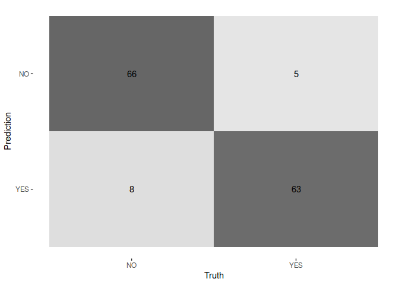<!-- -->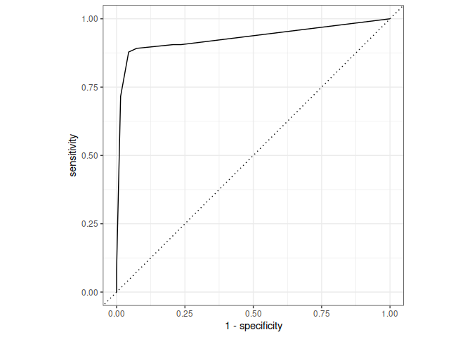<!-- -->

    ## # A tibble: 1 × 3
    ##   .metric .estimator .estimate
    ##   <chr>   <chr>          <dbl>
    ## 1 roc_auc binary         0.929

The evaluation results in a good performance given the simplicity of the
model.

``` r
tree %>% extract_fit_engine() %>% rpart.plot(roundint = F)
```

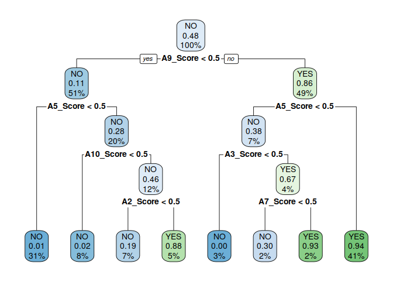<!-- -->

From the tree diagram the *A9* score is the most important one in
classifying a person with ASD, which is consistent with the variable
importance analysis.

In contrast to that analysis however, *age* does not compare in
variables chosen for the splits.

## Conclusions

| Model             | Balanced | Imbalanced |
|-------------------|:--------:|:----------:|
| Random forest     |  0.983   |    0.97    |
| Gradient boosting |  0.965   |   0.961    |

The trained models both gave a good performance with an f1 score close
to *0.97*. The random forest is slightly superior to the gradient
boosting both in the balanced and imbalanced data case. Balancing the
data allows for a slight increase in performance on the random forest
while it stays almost the same in the gradient boosting.

What emerges from a simple tree interpretation is that the answer to the
question *9* is a fundamental factor in predicting ASD.

This last result should be checked with professionals to see if it
actually makes sense.
